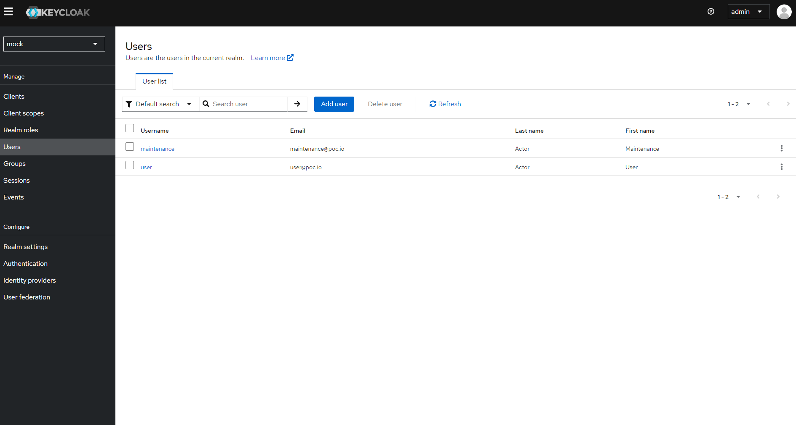
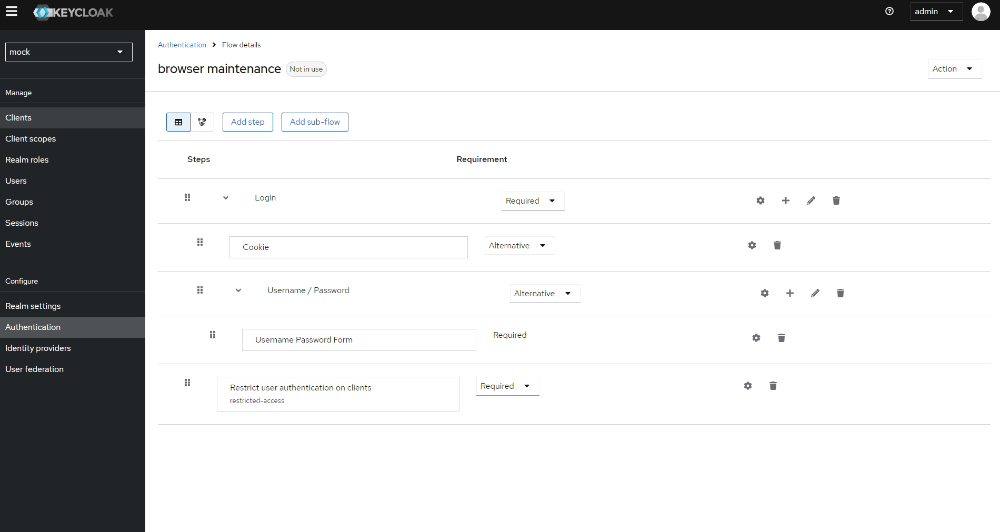

# Description
PoC Keycloak Restriction Extension for role and policy based flow modes

## Steps

- **STEP01**: compile the last Restrict Keycloak Client Extension

```
./keycloak-restrict-client-auth/mvnw clean install
```

- **STEP02**: deployed keycloak 25.0.2 with the new extension configured:

```
docker run \
-d \
--name consum-keycloak-restriction \
-p 8080:8080 \
-e KEYCLOAK_ADMIN=admin -e KEYCLOAK_ADMIN_PASSWORD=password \
-v ./keycloak-restrict-client-auth/target/keycloak-restrict-client-auth.jar:/opt/keycloak/providers/keycloak-restrict-client-auth.jar \
quay.io/keycloak/keycloak:25.0.2 start-dev
```

- **STEP03**: Created a new realm

Created a new realm named **mock**


- **STEP04**: Created a new client

 Created a new client named **mock** with the client authentication activated, inside the previous realms


- **STEP05**: Created two roles
 
 Created two roles inside the previous client, like this:

 - User role with name **user**. This is a generic role to be tested
 - Restricted Access role with name **restricted-access**. This is the default restriction role used by the Authenticator extension to control the access.


- **STEP06**: Created two users
 
 Created two users and asign the previous roles to each one like this:

 - User with name **user** attached to the role **user** of the client **mock**
 - User with name **maintenance** attached to the role **restricted-access** of the client **mock**



 - **STEP07**: Created a restriction flow
 
 Create a new flow named **direct grant maintenance** cloned from **direct grant** default flow adding a new subflow at last, where implement the restriction task **Restric user authentication on clients** (supported by the extension) like this:


- **STEP08**: Configure Restric user authentication on clients task
 
Configure **Restric user authentication on clients** task like this. We must set the same alias as the default restriction role name previously configured as **restricted-access**


- **STEP09**: Bind Restriction Flow to direct grant default flow
 
After save the **direct grant maintenance** flow bind this flow to default direct grant flow, like this:


- **STEP10**: end-to-end tests
 
From postman we will try to login using the maintenace account. The result will be success because this user has the **restricted-access** role asigned:


Now we will login from postman again but using the user account. The result will be an **access denied** error because the **restricted-access** role is not attached to this account:


- **STEP11**: Bonus: restrict access to account profile

We can restrict also the access to account creating a new flow cloned from browser default flow like this



We must bind this custom flow to Browser default flow and configure as previuslly the task **Restric user authentication on clients** 

Now if we open the from ui the account access for our realm lije this an use the maintenace the user will logged correctly, but is we use the user we will obtain a **access denied** error

```
http://localhost:8080/realms/mock/account/
```

## Links

- [Ofitial Restrict Keycloak Client Extension](https://github.com/sventorben/keycloak-restrict-client-auth)
