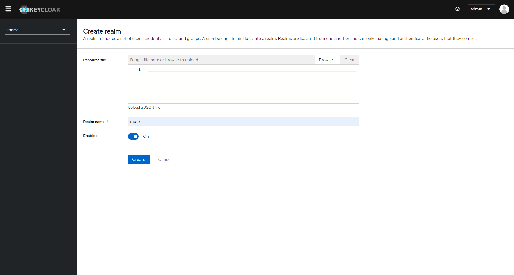
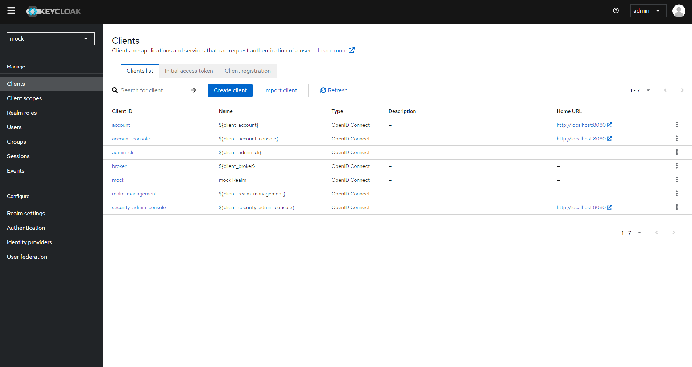
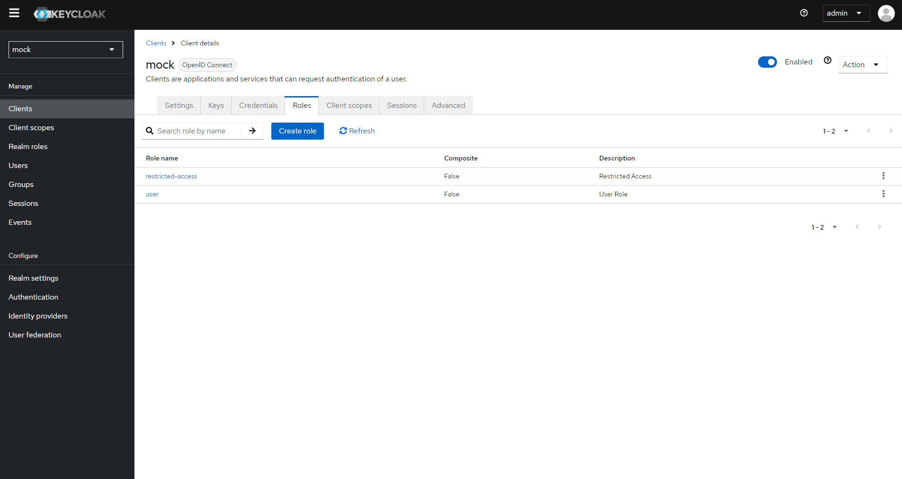
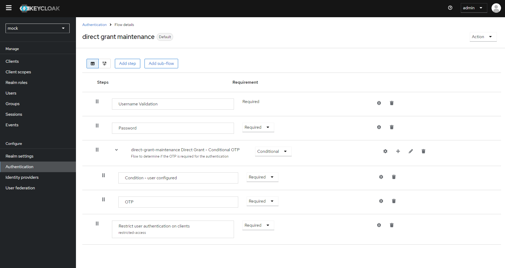
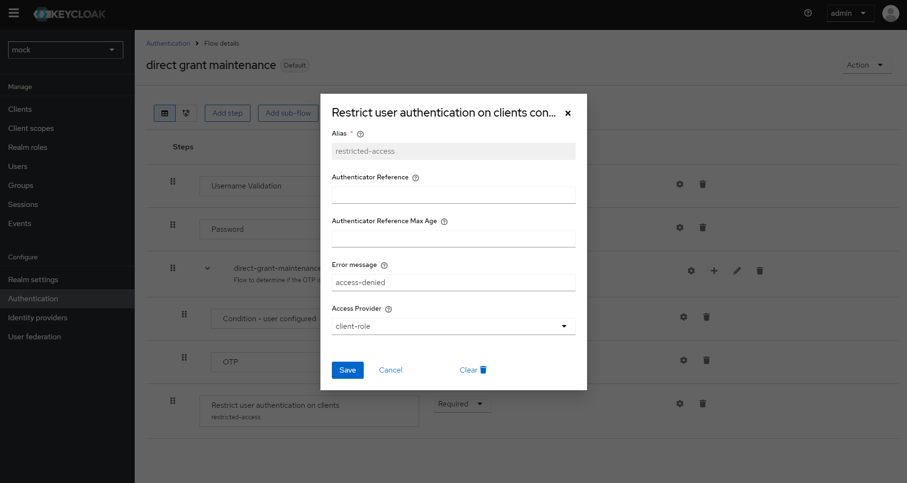
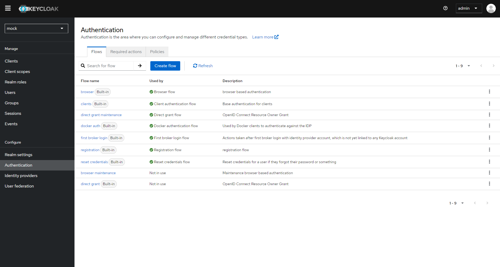
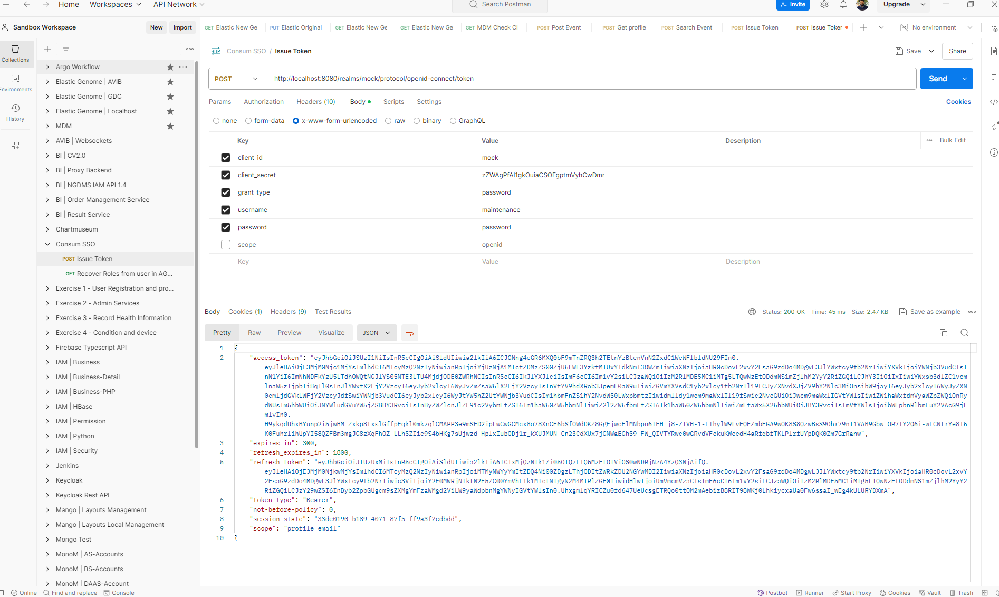
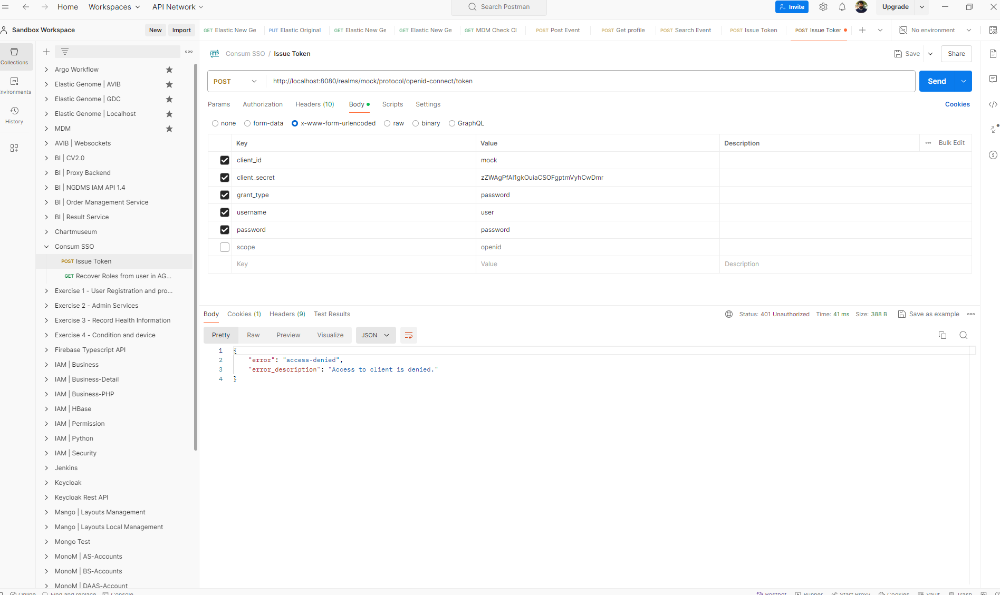

# Description
PoC Keycloak Restriction Extension for role and policy based flow modes

## Steps

- **STEP01**: compile the last Restrict Keycloak Client Extension

```
./keycloak-restrict-client-auth/mvnw clean install
```

- **STEP02**: deployed keycloak 25.0.2 with the new extension configured:

```
docker run \
-d \
--name consum-keycloak-restriction \
-p 8080:8080 \
-e KEYCLOAK_ADMIN=admin -e KEYCLOAK_ADMIN_PASSWORD=password \
-v ./keycloak-restrict-client-auth/target/keycloak-restrict-client-auth.jar:/opt/keycloak/providers/keycloak-restrict-client-auth.jar \
quay.io/keycloak/keycloak:25.0.2 start-dev
```

- **STEP03**: Created a new realm

Created a new realm called **mock**



- **STEP04**: Created a new client

 Created a new client called **mock** with the client authentication activated, inside the previous realms



- **STEP04**: Created two roles
 
 Created two roles inside the previous client, like this:

 - User role with name **user**. This is a generic role to be tested
 - Restricted Access role witj name **restricted-access**. This is the default restriction role used by the Authenticator extension to control the access.



- **STEP05**: Created two users
 
 Created two users and asign the previous roles to each one like this:

 - User with name **user** attached to the role **user** of the client **mock**
 - User with name **maintenance** attached to the role **restricted-access** of the client **mock**

 - **STEP06**: Created a restriction flow
 
 Create a new restriction flow cloned from **direct grant** default flow adding a new subflow at last where implement the restriction task like this:



- **STEP07**: Configure Restric user authentication on clients task
 
Configure Restric user authentication on clients task like this. We must set the same alias as the default restriction role name previous configured as **restricted-access**



- **STEP08**: Bind Restriction Flow to direct grant
 
After save the custom flow binf this flow to default direct grant flow. Like this



- **STEP09**: end-to-end test
 
From postmand we try to login using the maintenace account. The result will be success because this user has the **restricted-access** role asigned



Now we will login from postmand using the user account. The result will be an **access denied** error becasuse the client defined the **restricted-access** role and this account is not attached to it



## Links

- [Ofitial Restrict Keycloak Client Extension](https://github.com/sventorben/keycloak-restrict-client-auth)